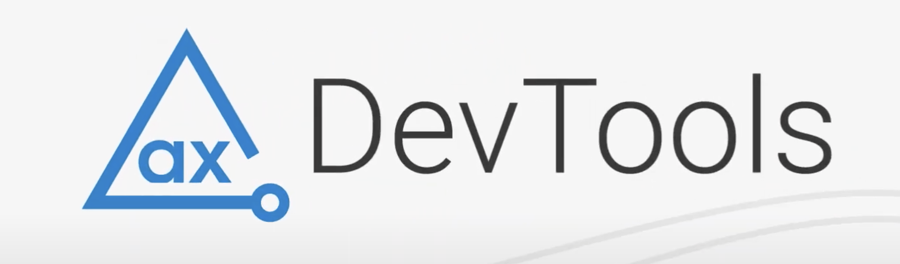

# React News App
A React application interacting with a News API and displaying results based on selected country and topic.


> A modern, accessible React news application demonstrating best practices in component development, API integration, and responsive design.

<div align="center">

## 🚀 [Live Demo](https://chipper-melba-9f5487.netlify.app/)
*Experience the app in action*

<!-- [](https://chipper-melba-9f5487.netlify.app/) -->

</div>

---

## 📋 Table of Contents

- [🎯 About The App](#-about-the-app)
- [📊 Data Source](#-data-source)
- [🛠️ Technologies](#️-technologies)
- [⚙️ Setup & Installation](#️-setup--installation)
- [🏗️ Development Approach](#️-development-approach)
- [📱 Features](#-features)
- [♿ Accessibility](#-accessibility)
- [🔄 Status & Roadmap](#-status--roadmap)
- [👥 Credits](#-credits)
- [📄 License](#-license)

---

## 🎯 About The App

<table>
<tr>
<td width="60%" valign="top">

**Project Overview**

The React News App is a showcase application demonstrating modern React development practices, including:

- ⚛️ **React Hooks** implementation (useState, useEffect, useRef)
- 🌐 **External API integration** with intelligent fallback strategies
- 📱 **Mobile-first responsive design** using CSS Grid and Flexbox
- ♿ **Accessibility-first development** with semantic HTML
- 🎨 **Custom CSS architecture** following BEM methodology
- 🌍 **Internationalization** with JavaScript Intl API

**Key Highlights:**
- Zero framework dependencies for styling
- Semantic HTML structure for screen readers
- Performance-optimized API calls
- Cross-browser compatibility

</td>
<td width="40%">

</td>
</tr>
</table>

---

## 📊 Data Source

<table>
<tr>
<td width="30%">

</td>
<td width="70%" valign="top">

**GNews API Integration**

🔗 **Source:** [GNews.io](https://gnews.io/)

**Implementation Details:**
- 📈 **API Limit:** 100 calls per day with intelligent rate limiting
- 🔄 **Fallback Strategy:** Local JSON files for testing and backup
- 🔑 **Key Rotation:** Multiple API keys for extended usage
- 💾 **Caching Strategy:** Planned for v2.0 to reduce API calls

**Planned Improvements:**
- Daily automated fallback file generation
- Advanced caching mechanism per news category
- Offline-first approach with service workers

</td>
</tr>
</table>

---

## 🛠️ Technologies

### **Core Stack**


### **Development Tools**


### **Architecture Principles**
- 🏗️ **BEM CSS Methodology** for maintainable styling
- 📱 **Mobile-First Design** with progressive enhancement
- ♿ **WCAG 2.1 Compliance** for accessibility standards
- 🎨 **Component-Based Architecture** for reusability

---

## ⚙️ Setup & Installation

### **Prerequisites**
- Node.js (v14 or higher)
- npm or yarn package manager

### **Quick Start**

```bash
# Clone the repository
git clone https://github.com/yodiyo/react-news-app.git

# Navigate to project directory
cd react-news-app

# Install dependencies
npm install

# Start development server
npm start
```

The application will be available at `http://localhost:3000`

### **Available Scripts**

| Command         | Description                        |
| --------------- | ---------------------------------- |
| `npm start`     | 🚀 Runs the app in development mode |
| `npm test`      | 🧪 Launches the test runner         |
| `npm run build` | 📦 Builds the app for production    |
| `npm run eject` | ⚠️ Ejects from Create React App     |

---

## 🏗️ Development Approach

### **React Hooks Implementation**
- **`useState`** - Managing component state and user interactions
- **`useEffect`** - Handling side effects and API calls
- **`useRef`** - Creating mutable objects for performance optimization

### **CSS Architecture**
```
src/
├── styles/
│   ├── reset.css          # Modern CSS reset
│   ├── variables.css      # Design tokens and CSS custom properties
│   ├── typography.css     # Font styles and text formatting
│   ├── components/        # Component-specific styles
│   └── layouts/           # Layout and grid systems
```

### **Responsive Design Strategy**
- 📱 **Mobile-First** approach starting from 320px
- 🖥️ **Progressive Enhancement** for larger screens
- 🎨 **CSS Grid & Flexbox** for flexible layouts
- 📐 **Fluid Typography** using clamp() functions

---

## 📱 Features

### **✅ Implemented**
- 🔍 **Dynamic News Search** by category
- 📱 **Fully Responsive Design** across all devices
- ♿ **Screen Reader Compatible** with semantic HTML
- 🌍 **Localized Date Formatting** using Intl API
- ⚡ **Performance Optimized** API calls
- 🎨 **Custom UI Components** without external frameworks

### **🚧 Planned for v2.0**
- 💾 **Enhanced Caching System** for improved performance
- 🔄 **Real-time Updates** with WebSocket integration
- 🔍 **Advanced Search Filters** and sorting options
- 📰 **Bookmarking System** for favorite articles
- 🌙 **Dark Mode Support** with theme switching
- 📊 **Analytics Dashboard** for reading patterns

---

## ♿ Accessibility

<table>
<tr>
<td width="40%">

</td>
<td width="60%" valign="top">

**Accessibility Testing**

✅ **Axe DevTools Validated** - Zero accessibility issues reported

**Implementation Features:**
- 🏗️ **Semantic HTML** structure (header, main, footer, sections)
- 🎯 **ARIA Labels** for interactive elements
- ⌨️ **Keyboard Navigation** support
- 🎨 **High Contrast** text over background images
- 📱 **Screen Reader** optimized content structure

</td>
</tr>
</table>

---

## 🔄 Status & Roadmap


### **Current Phase: Demo & Feedback**
This is a demonstration project showcasing React development skills. All feedback and suggestions for improvements are welcome!

### **Future Enhancements**
- [ ] Implement comprehensive caching strategy
- [ ] Add unit and integration tests
- [ ] Create component documentation with Storybook
- [ ] Optimize bundle size and performance metrics
- [ ] Add Progressive Web App (PWA) features

---

## 👥 Credits

### **Development Team**
- 👨‍💻 **[Yorick Brown](https://theyoricktouch.com)** - Lead Developer & Designer

### **Resources & Tools**
- ⚛️ **[Create React App](https://create-react-app.dev/)** - React application foundation
- 📰 **[GNews API](https://gnews.io/)** - News data provider
- 🎨 **[Unsplash](https://unsplash.com/)** - Header image by [Flipboard](https://unsplash.com/@flipboard)
- 🎨 **[Piccalilli CSS Reset](https://piccalil.li/blog/a-more-modern-css-reset/)** - Modern CSS reset
- ♿ **[Axe DevTools](https://www.deque.com/axe/devtools/)** - Accessibility testing

---

## 📄 License

```
MIT License

Copyright (c) 2024 Yorick Brown

Permission is hereby granted, free of charge, to any person obtaining a copy
of this software and associated documentation files (the "Software"), to deal
in the Software without restriction, including without limitation the rights
to use, copy, modify, merge, publish, distribute, sublicense, and/or sell
copies of the Software, and to permit persons to whom the Software is
furnished to do so, subject to the following conditions:

The above copyright notice and this permission notice shall be included in all
copies or substantial portions of the Software.
```

**📧 Contact:** [theyoricktouch.com](https://theyoricktouch.com)

---

<div align="center">
  <br>
  <p><em>Built with ❤️ and modern React practices</em></p>

  
  

  <br>

  **🌟 Star this repo if you found it helpful!**
</div>
